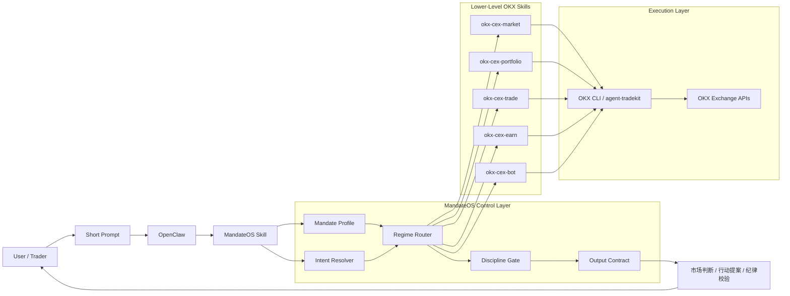
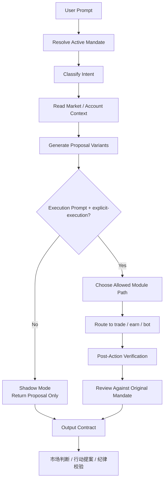

# Architecture Diagram

Use these Mermaid diagrams in GitHub, OpenClaw docs, or your competition deck.

## System Architecture

## Request Flow

## Slide-Friendly Framing

Use this one-liner under the diagram:

`MandateOS adds a mandate-aware control layer above OKX skills, so one short prompt becomes a disciplined multi-skill workflow instead of a single raw API call.`
